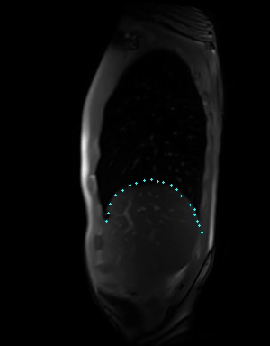

# co-tracker-for-MRI
use co-tracker to segment medical videos, like MRI, CT...

**CoTracker** is a fast transformer-based model that can track any point in a video. It brings to tracking some of the benefits of Optical Flow.

 
 In track-navigators.py, we can select some points, and use co-tracker to aotomatically track these points in the entire video, giving back a npy file, and a mp4 vedio.

## Installation Instructions
Please following the instructions of co-tracker.

## Acknowledgments
This application is based on [co-tracker](https://github.com/facebookresearch/co-tracker).

